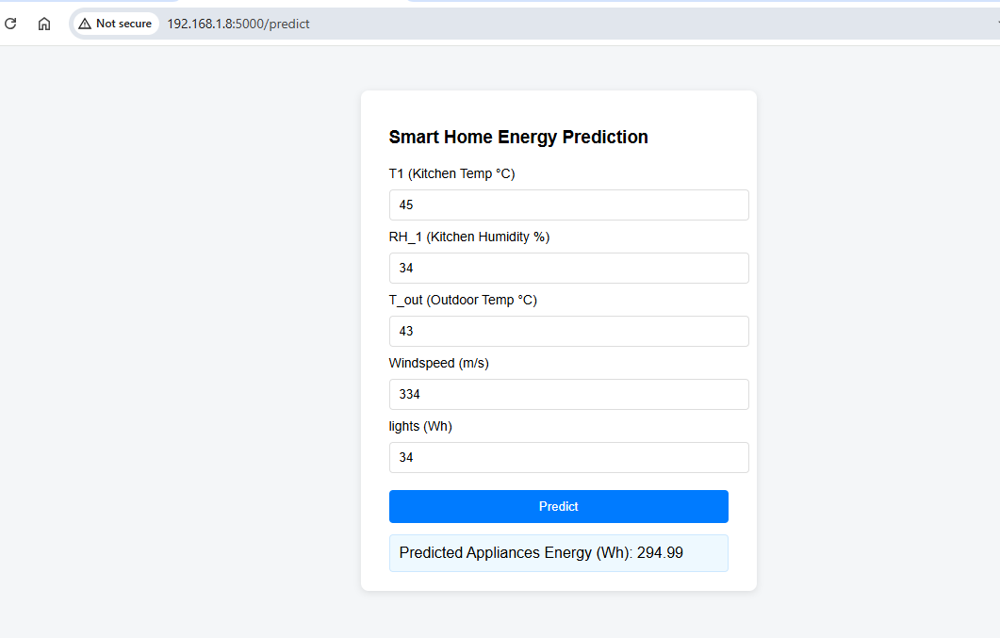

# ⚡ Energy Consumption Prediction (Machine Learning + Flask + Docker)

This project is a **Machine Learning web application** that predicts household **Appliance Energy Consumption (Wh)** based on environmental factors.  
It uses a trained **Random Forest Regression model** wrapped in a **Flask web app**, with optional **Docker deployment** for portability.

---

## 🧠 Project Overview

The goal of this project is to estimate the **energy usage of household appliances** using features such as:
- **T1**: Temperature in the living room (°C)  
- **RH_1**: Relative Humidity in the living room (%)  
- **T_out**: Outdoor temperature (°C)  
- **Windspeed**: Outdoor wind speed (m/s)  
- **lights**: Energy used for lighting (Wh)

The model was trained on the `energydata_complete.csv` dataset.

---
## Output Screenshort


---

## 🏗️ Project Structure

├── app.py # Flask web app
├── energy_model.py # Model training script
├── energy_model.pkl # Trained Random Forest model
├── energy_scaler.pkl # Feature scaler (StandardScaler)
├── energydata_complete.csv # Source dataset
├── Dockerfile # For Docker image creation
├── requirements.txt # Dependencies list
├── output.png # Screenshot of UI/output
└── README.md # Project documentation


---

## 🚀 Features

✅ Train and save a regression model using `energy_model.py`  
✅ Flask web interface to input features and get predictions  
✅ Model deployment via **Docker**  
✅ Modular and production-ready code design  
✅ Scalable and portable ML API  

---

## ⚙️ Model Details

- **Algorithm:** Random Forest Regressor  
- **Preprocessing:** StandardScaler (feature scaling)  
- **Metrics Used:** MAE, MSE, R² Score during experimentation  
- **Input Features:** `T1, RH_1, T_out, Windspeed, lights`  
- **Target:** `Appliances` (Wh)

---

## 🧩 How It Works

1. **Data Preparation:**  
   The dataset is cleaned and filtered to include relevant features and target.

2. **Feature Scaling:**  
   A `StandardScaler` normalizes numerical features for consistent model performance.

3. **Model Training:**  
   A Random Forest Regressor is trained and saved as `energy_model.pkl`.

4. **Web Interface:**  
   Users input values for the five features via the Flask frontend, and the app returns predicted energy consumption.

---

## 💻 Run Locally

### 1. Clone the Repository
```bash
git clone https://github.com/<your-username>/energy-consumption-predictor.git
cd energy-consumption-predictor
```

---

##  Create Virtual Environment
```code
python -m venv venv
source venv/bin/activate   # Mac / Linux
venv\Scripts\activate      # Windows
```

---

##  Install Dependencies
```code
pip install -r requirements.txt
```

## Train Model
```code
python energy_model.py
```

## Run Flask App
```code
python app.py
```
Visit: http://127.0.0.1:5000

## 🐳 Run with Docker
Build Docker Image
```code
docker build -t energy-app
```
#### Run Container
```code
docker run -p 5000:5000 energy-app
```

Then open: http://localhost:5000

---

## 🧪 Example Prediction

| Category | Feature Name | Example Value | Unit |
| :--- | :--- | :--- | :--- |
| Input | $T_{1}$ (Temperature 1) | $20.5$ | °C |
| Input | $RH_{1}$ (Relative Humidity 1) | $45.2$ | % |
| Input | $T_{\text{out}}$ (Outside Temperature) | $10.3$ | °C |
| Input | $Windspeed$ | $5.6$ | m/s |
| Input | $lights$ | $30$ | Wh |
| **Output** | **Predicted Appliances Energy** | **123.47** | **Wh** |

## 🧰 Technologies Used

* **Python** 3.10+
* **Flask** (Web Framework)
* **Scikit-learn** (Machine Learning Library)
* **Pandas** (Data Manipulation and Analysis)
* **NumPy** (Numerical Computing)
* **Joblib** (Model persistence/serialization)
* **Docker** (Containerization)
* **Gunicorn** (Web Server Gateway Interface for production deployment)

## 🔍 Future Improvements

* **Integrate feature scaling** directly into Flask prediction endpoints to ensure consistency between training and serving.
* Add robust **error handling and input validation** for API requests.
* Include **model evaluation plots** (Mean Absolute Error (MAE), Mean Squared Error (MSE), and $R^2$) in the project documentation or monitoring dashboard.
* Deploy the application to major **cloud platforms** (such as AWS, Render, or Railway) for accessibility and scalability.
